# AI Customer Service Platform - Architecture Overview

## System Architecture

## Technology Stack

## Data Flow Architecture

## Component Architecture

## Security Architecture

```mermaid
graph TB
    subgraph "🔐 Authentication Layer"
        Login[User Login]
        JWT[JWT Tokens]
        Session[Session Management]
    end

    subgraph "🛡️ Authorization Layer"
        RBAC[Role-Based Access]
        OrgScope[Organization Scoping]
        APIKeys[API Key Management]
    end

    subgraph "🔒 Data Protection"
        Encryption[Data Encryption]
        Sanitization[Input Sanitization]
        RateLimit[Rate Limiting]
    end

    subgraph "🚨 Security Monitoring"
        Logging[Security Logging]
        Audit[Audit Trail]
        Alerts[Security Alerts]
    end

    Login --> JWT
    JWT --> Session
    Session --> RBAC
    RBAC --> OrgScope
    OrgScope --> APIKeys
    
    APIKeys --> Encryption
    Encryption --> Sanitization
    Sanitization --> RateLimit
    
    RateLimit --> Logging
    Logging --> Audit
    Audit --> Alerts
```

## Deployment Architecture

## Key Features

### 🤖 AI-Powered Chat
- **Multi-Model Support**: OpenAI GPT-4, GPT-3.5-turbo
- **Context Awareness**: Conversation history and user context
- **Tool Integration**: Custom functions and database queries
- **Real-time Streaming**: Live response generation

### 👥 Agent Management
- **Dynamic Configuration**: Customizable AI personalities
- **Performance Monitoring**: Analytics and metrics
- **Multi-tenant Support**: Organization-based isolation
- **Version Control**: Agent configuration versioning

### 🔗 Integration Ecosystem
- **REST API**: Full programmatic access
- **Webhook Support**: Real-time event notifications
- **Embeddable Widget**: Easy website integration
- **Third-party Connectors**: CRM, helpdesk, and analytics tools

### 🛡️ Enterprise Security
- **Authentication**: Multi-factor authentication support
- **Authorization**: Role-based access control
- **Data Privacy**: GDPR and compliance ready
- **Audit Logging**: Complete activity tracking

---

*This architecture is designed for scalability, maintainability, and extensibility to support growing customer service operations.*
