# AI Customer Service Platform - Architecture Overview

## System Architecture

## Technology Stack

```mermaid
graph LR
    subgraph "🎨 Frontend Stack"
        NextJS[Next.js 15]
        React[React 19]
        TypeScript[TypeScript]
        Mantine[Mantine UI 8]
        Tailwind[Tailwind CSS]
        AssistantUI[Assistant-UI React]
    end

    subgraph "⚡ Backend Stack"
        NextAPI[Next.js API Routes v2]
        OpenAIAgents[OpenAI Agents SDK]
        MCPFramework[MCP Framework]
        Prisma[Prisma ORM]
        Middleware[Custom Middleware]
    end

    subgraph "🗄️ Database Stack"
        SupabaseDB[(Supabase PostgreSQL)]
        Vector[(pgvector Extension)]
        Auth[(Supabase Auth)]
        RLS[(Row Level Security)]
    end

    subgraph "🤖 AI & Integration Stack"
        OpenAI[OpenAI Multiple Models]
        MCP[Model Context Protocol]
        Shopify[Shopify MCP Server]
        Stripe[Stripe MCP Server]
        CustomMCP[Custom MCP Server]
        Guardrails[Custom Guardrails]
    end

    NextJS --> NextAPI
    NextAPI --> OpenAIAgents
    OpenAIAgents --> OpenAI
    NextAPI --> MCPFramework
    MCPFramework --> MCP
    MCP --> Shopify
    MCP --> Stripe
    MCP --> CustomMCP
    NextAPI --> Prisma
    Prisma --> SupabaseDB
    SupabaseDB --> Vector
    SupabaseDB --> Auth
    Auth --> RLS
```

### Detailed Technology Breakdown

#### Frontend Framework
- **Next.js 15**: React-based full-stack framework with App Router and Server Components
- **React 19**: Latest React with concurrent features and streaming SSR
- **TypeScript**: Full type safety across frontend and backend

#### UI/UX Libraries  
- **Mantine UI 8**: Modern React component library with dark/light theme support
- **Tailwind CSS**: Utility-first CSS framework for custom styling
- **Assistant-UI React**: Specialized chat interface components optimized for AI conversations

#### AI Agent Runtime
- **OpenAI Agents SDK**: Official agent runtime using `@openai/agents` package
- **Model Context Protocol (MCP)**: Standardized tool integration framework
- **Custom MCP Servers**: Shopify, Stripe, and business-specific tool implementations

#### Database & Storage
- **Supabase PostgreSQL**: Managed PostgreSQL with built-in authentication
- **pgvector Extension**: Vector storage for AI embeddings and semantic search
- **Row Level Security**: Database-level access controls and multi-tenancy

#### API & Backend
- **Next.js API Routes v2**: Modern RESTful API endpoints in `/app/api/v2/`
- **Streaming Responses**: Real-time message delivery for chat interfaces
- **Custom Middleware**: Authentication, rate limiting, and security layers

## Data Flow Architecture

## Application Structure

```mermaid
graph TD
    subgraph "📱 App Directory Structure"
        App[app/]
        AppRoutes[API Routes v2]
        Pages[Page Components]
        Layout[Layout Components]
    end

    subgraph "🧩 Components Layer"
        Dashboard[Dashboard Components]
        Agents[Agent Management]
        Chat[Chat Interface]
        Widget[Widget Components]
    end

    subgraph "� Library Layer"
        AgentLib[lib/agents/]
        MCPLib[lib/mcp/]
        AuthLib[lib/auth/]
        GuardrailLib[lib/guardrails/]
        TypesLib[lib/types/]
    end

    subgraph "🔧 MCP Ecosystem"
        MCPClient[MCP Client]
        ShopifyServer[Shopify MCP Server]
        StripeServer[Stripe MCP Server]
        CustomServer[Custom Tools MCP Server]
    end

    subgraph "�️ Database Schema"
        UserModel[User Model]
        AgentModel[Agent Model]
        ConversationModel[Conversation Model]
        IntegrationModel[Integration Model]
    end

    App --> AppRoutes
    App --> Pages
    App --> Layout
    
    Pages --> Dashboard
    Pages --> Agents
    Pages --> Chat
    Pages --> Widget
    
    Dashboard --> AgentLib
    Chat --> MCPLib
    Widget --> AuthLib
    Agents --> GuardrailLib
    
    MCPLib --> MCPClient
    MCPClient --> ShopifyServer
    MCPClient --> StripeServer
    MCPClient --> CustomServer
    
    AgentLib --> UserModel
    AgentLib --> AgentModel
    Chat --> ConversationModel
    MCPLib --> IntegrationModel
```

## Component Architecture

## Security Architecture

## Deployment Architecture

## Key Features

### 🤖 AI-Powered Chat
- **Multi-Model Support**: OpenAI GPT-4, GPT-3.5-turbo
- **Context Awareness**: Conversation history and user context
- **Tool Integration**: Custom functions and database queries
- **Real-time Streaming**: Live response generation

### 👥 Agent Management
- **Dynamic Configuration**: Customizable AI personalities
- **Performance Monitoring**: Analytics and metrics
- **Multi-tenant Support**: Organization-based isolation
- **Version Control**: Agent configuration versioning

### 🔗 Integration Ecosystem
- **REST API**: Full programmatic access
- **Webhook Support**: Real-time event notifications
- **Embeddable Widget**: Easy website integration
- **Third-party Connectors**: CRM, helpdesk, and analytics tools

### 🛡️ Enterprise Security
- **Authentication**: Multi-factor authentication support
- **Authorization**: Role-based access control
- **Data Privacy**: GDPR and compliance ready
- **Audit Logging**: Complete activity tracking

---

*This architecture is designed for scalability, maintainability, and extensibility to support growing customer service operations.*
